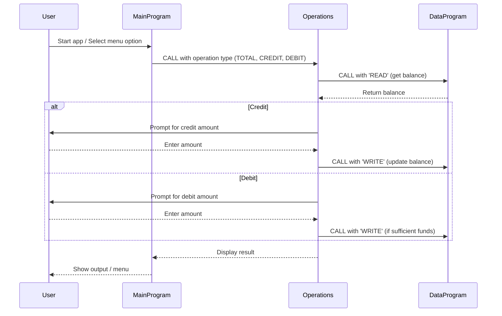

# COBOL Student Account Management System

This project is a simple COBOL-based system for managing student accounts, including viewing balances, crediting, and debiting accounts. The system is organized into three main COBOL files, each with a specific role.

## File Overview

### 1. `main.cob`
**Purpose:**
- Acts as the entry point and user interface for the application.
- Presents a menu to the user for account operations: View Balance, Credit Account, Debit Account, and Exit.
- Handles user input and delegates operations to the `operations.cob` module.

**Key Logic:**
- Loops until the user chooses to exit.
- Uses the `CALL` statement to invoke the `Operations` program for each action.

### 2. `operations.cob`
**Purpose:**
- Implements the core business logic for account operations.
- Handles three main operations: viewing the balance, crediting the account, and debiting the account.
- Interacts with the data storage logic in `data.cob`.

**Key Functions:**
- **View Balance:** Calls `DataProgram` with 'READ' to fetch and display the current balance.
- **Credit Account:** Prompts for an amount, reads the current balance, adds the amount, writes the new balance, and displays the result.
- **Debit Account:** Prompts for an amount, reads the current balance, checks for sufficient funds, subtracts the amount if possible, writes the new balance, and displays the result. If funds are insufficient, displays an error message.

**Business Rules:**
- Debit operations are only allowed if the account has sufficient funds.
- All balance updates are persisted via the data program.

### 3. `data.cob`
**Purpose:**
- Manages persistent storage of the account balance.
- Provides read and write operations for the balance.

**Key Functions:**
- **READ:** Returns the current stored balance.
- **WRITE:** Updates the stored balance with a new value.

**Business Rules:**
- The initial balance is set to 1000.00.
- All balance changes are made through this module to ensure data consistency.

## Business Rules Summary
- Only one account is managed (no multi-user support).
- Debit operations require sufficient funds; otherwise, the operation is denied.
- The balance is initialized to 1000.00 and persists across operations within a session.

---

## Sequence Diagram: Data Flow

---

For more details, see the source code in `/src/cobol/`.
